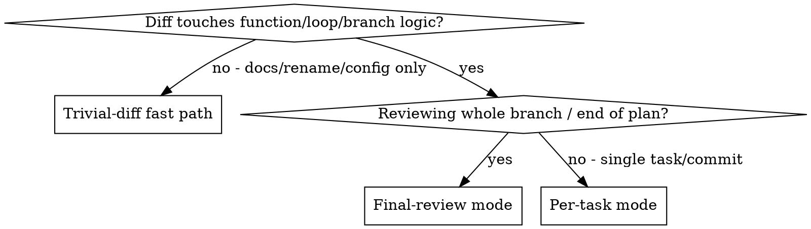

# Ultimatepowers Integration Implementation Plan

> **For agentic workers:** REQUIRED SUB-SKILL: Use superpowers:subagent-driven-development (recommended) or superpowers:executing-plans to implement this plan task-by-task. Steps use checkbox (`- [ ]`) syntax for tracking.

**Goal:** Build the ultimatepowers plugin at the repo root: superpowers v5.1.0 rebranded, plus four formal-verification skills (digested from FVK) wired automatically into both review paths.

**Architecture:** Copy the pinned superpowers tree verbatim to the repo root, rebrand the namespace (`superpowers:` → `ultimatepowers:`, paths, manifests, hook), author 4 new skills carrying FVK's K-as-notation method, and wire a formal reviewer into `requesting-code-review` (parallel dual dispatch) and `subagent-driven-development` (parallel with the quality reviewer). Formal review output persists under `docs/ultimatepowers/verification/`.

**Tech Stack:** Bash, markdown skills, JSON manifests, jq, rsync, git. Zero runtime dependencies (upstream design principle — no K toolchain is ever executed).

**Canonical sources (read before each task; absolute paths):**
- Spec: `/home/xc/Projects/ultimatepowers/docs/ultimatepowers/specs/2026-06-12-ultimatepowers-design.md`
- Superpowers research: `/home/xc/Projects/ultimatepowers/docs/research/superpowers-analysis.md`
- FVK research (knowledge digest): `/home/xc/Projects/ultimatepowers/docs/research/fvk-analysis.md`
- Upstream submodules (READ ONLY — never modify): `/home/xc/Projects/ultimatepowers/reference/superpowers/`, `/home/xc/Projects/ultimatepowers/reference/formal-verification-kit/`

**Fixed conventions (apply everywhere; do not re-decide):**
- Repo root = `/home/xc/Projects/ultimatepowers`. All relative paths below are relative to it.
- Plugin name `ultimatepowers`, dev marketplace `ultimatepowers-dev`, version `1.0.0`.
- Canonical repo URL: `https://github.com/xc-math/ultimatepowers` (single consistent string; derived from maintainer email `xc.math@gmail.com`. If hosting differs later, it is one `sed` away — README Task 7 notes this).
- Author field everywhere: `{ "name": "ultimatepowers maintainers", "email": "xc.math@gmail.com" }`.
- Skill directory names are NEVER renamed (including `using-superpowers/` — the hook, GEMINI.md, and OpenCode bootstrap depend on it). Only the namespace prefix changes.
- The string `ultimatepowers` does NOT contain the substring `superpowers` (ultimate+powers), so `grep superpowers` finds only stale refs.
- Attribution footer for every new formal file (verbatim, last line of each file):
  `*Derived from grosu/formal-verification-kit (MIT, Copyright (c) 2026 Grigore Rosu). See LICENSE and README credits.*`
- Status-label vocabulary (verbatim, used in all formal skills): `constructed` / `machine-checked` / `constructed (escalation-bounded)`; per-obligation marker `[ESCALATION BOUNDARY]`; `#Top` is the only thing that upgrades constructed → machine-checked.
- Each task ends: run its verification commands, then commit. Work happens on this repo's checkout (single-purpose repo; use a worktree/branch per superpowers:using-git-worktrees if the session prefers isolation).

---

### Task 1: Scaffold — copy superpowers v5.1.0 to repo root

**Files:**
- Create: entire upstream tree at repo root (skills/, hooks/, tests/, scripts/, assets/, .claude-plugin/, .codex-plugin/, .cursor-plugin/, .opencode/, .github/, manifests, README.md, LICENSE, CLAUDE.md, AGENTS.md symlink, GEMINI.md, .gitignore, .gitattributes, .version-bump.json, package.json, CODE_OF_CONDUCT.md)
- Excluded from copy: upstream `.git` (submodule gitlink), upstream `docs/` (historical dogfood artifacts), upstream `RELEASE-NOTES.md` (upstream changelog)
- Must NOT touch: `docs/` (ours: research + specs + this plan), `reference/`, `.gitmodules`, `.git/`

- [ ] **Step 1: Rsync the tree**

```bash
cd /home/xc/Projects/ultimatepowers
rsync -a \
  --exclude='.git' \
  --exclude='/docs/' \
  --exclude='/RELEASE-NOTES.md' \
  reference/superpowers/ ./
```

Note: `-a` preserves the executable bits on `hooks/session-start`, `hooks/run-hook.cmd`, shell scripts, and the `AGENTS.md -> CLAUDE.md` symlink. Leading `/` anchors `docs/` and `RELEASE-NOTES.md` to the transfer root so only upstream's top-level ones are excluded.

- [ ] **Step 2: Verify the copy**

```bash
cd /home/xc/Projects/ultimatepowers
ls skills | wc -l                          # expected: 14
test ! -e RELEASE-NOTES.md && echo OK      # expected: OK
test ! -d docs/plans && echo OK            # expected: OK (upstream docs/ not copied)
test -d docs/ultimatepowers/specs && echo OK   # expected: OK (our docs intact)
test -d docs/research && echo OK           # expected: OK
test -x hooks/session-start && test -x hooks/run-hook.cmd && echo OK  # expected: OK
readlink AGENTS.md                         # expected: CLAUDE.md
diff -r reference/superpowers/skills skills && echo IDENTICAL  # expected: IDENTICAL
git -C reference/superpowers status --porcelain | wc -l        # expected: 0 (submodule untouched)
```

- [ ] **Step 3: Commit**

```bash
cd /home/xc/Projects/ultimatepowers
git add -A
git status --short | grep -cv '^A '    # expected: 0 (only additions; no pre-existing file modified/deleted)
git commit -m "feat: scaffold from superpowers v5.1.0 (commit 6fd4507), excluding upstream docs/ and RELEASE-NOTES.md"
```

---

### Task 2: Rebrand sweep — superpowers → ultimatepowers

**Files:**
- Modify (sed sweep): everything under `skills/`, `hooks/`, `tests/` that contains `superpowers` (see Step 3 inventory)
- Modify (hand-edit first): `skills/brainstorming/scripts/frame-template.html`
- Rewrite (full content below): `.claude-plugin/plugin.json`, `.claude-plugin/marketplace.json`, `.codex-plugin/plugin.json`, `.cursor-plugin/plugin.json`, `gemini-extension.json`, `package.json`, `.version-bump.json`, `CLAUDE.md`, `.opencode/INSTALL.md`
- Rename: `.opencode/plugins/superpowers.js` → `.opencode/plugins/ultimatepowers.js`; `assets/superpowers-small.svg` → `assets/ultimatepowers-small.svg`
- Delete: `.github/` (upstream community/funding/PR-policy config), `CODE_OF_CONDUCT.md`, `scripts/sync-to-codex-plugin.sh` (upstream-fork mirror), `tests/codex-plugin-sync/` (tests that script)
- Do NOT touch: `LICENSE` (Task 7), `README.md` (Task 7), `GEMINI.md` (contains no `superpowers` string — only the unchanged `using-superpowers` path), `docs/`, `reference/`

- [ ] **Step 1: Pre-check the only upstream URL inside the sweep zone**

```bash
cd /home/xc/Projects/ultimatepowers
grep -rn 'obra/superpowers' skills/ hooks/ tests/
```

Expected: exactly one hit — `skills/brainstorming/scripts/frame-template.html:199`. If more appear, hand-fix each the same way as Step 2 before running Step 3.

- [ ] **Step 2: Hand-fix frame-template.html (so the blanket sed can't mangle the URL)**

In `skills/brainstorming/scripts/frame-template.html` replace:
- line 5: `  <title>Superpowers Brainstorming</title>` → `  <title>Ultimatepowers Brainstorming</title>`
- line 199: `    <h1><a href="https://github.com/obra/superpowers" style="color: inherit; text-decoration: none;">Superpowers Brainstorming</a></h1>` → `    <h1>Ultimatepowers Brainstorming</h1>`

- [ ] **Step 3: Blanket sed sweep over skills/, hooks/, tests/**

CRITICAL GUARD: the skill name `using-superpowers` contains the substring `superpowers` and must NOT change (the directory, frontmatter `name:`, hook path, GEMINI.md include, and OpenCode bootstrap all depend on it). The sed below shields it with a sentinel token before substituting and restores it after — so `superpowers:using-superpowers` correctly becomes `ultimatepowers:using-superpowers`, and paths like `skills/using-superpowers/SKILL.md` stay intact.

This single substitution then handles ALL of: `superpowers:` cross-refs (30 occurrences across 7 skill files: subagent-driven-development x8, writing-plans x5, executing-plans x5, writing-skills x4, gemini-tools.md x4, systematic-debugging x3, testing-skills-with-subagents x1; plus tests); `docs/superpowers/` paths (brainstorming SKILL.md x2, writing-plans SKILL.md x2, requesting-code-review SKILL.md, subagent-driven-development SKILL.md, spec-document-reviewer-prompt.md, test-helpers.sh, test-document-review-system.sh, test-subagent-driven-development-integration.sh, explicit-skill-requests/run-*.sh); `~/.config/superpowers/` legacy paths (using-git-worktrees x3, finishing-a-development-branch x2, subagent-driven-development x1, hooks/session-start); `.superpowers/` project dirs (visual-companion.md, start/stop-server.sh); `/tmp/superpowers-tests`; the hook banner, `'superpowers:using-superpowers'` string, and legacy-skills warning; prose "Superpowers" (executing-plans:14, finishing-a-development-branch:183, using-superpowers:20-22); `SUPERPOWERS_*` shell vars (tests/opencode); `superpowers@superpowers-dev` / `github.com/superpowers-test` in tests.

```bash
cd /home/xc/Projects/ultimatepowers
grep -rIl 'superpowers\|Superpowers\|SUPERPOWERS' skills/ hooks/ tests/ | xargs sed -i \
  -e 's/using-superpowers/__KEEP_USING_SP__/g' \
  -e 's/SUPERPOWERS/ULTIMATEPOWERS/g' \
  -e 's/Superpowers/Ultimatepowers/g' \
  -e 's/superpowers/ultimatepowers/g' \
  -e 's/__KEEP_USING_SP__/using-superpowers/g'
```

- [ ] **Step 4: Verify the sweep zone is clean**

```bash
cd /home/xc/Projects/ultimatepowers
# Zero stale refs; every remaining 'superpowers' hit must be part of 'using-superpowers':
grep -rIn -i 'superpowers' skills/ hooks/ tests/ GEMINI.md | grep -vi 'using-superpowers' | wc -l   # expected: 0
grep -rn '__KEEP_USING_SP__' skills/ hooks/ tests/ | wc -l             # expected: 0 (sentinel fully restored)
grep -n '^name: using-superpowers$' skills/using-superpowers/SKILL.md  # expected: 1 hit (line 2, unchanged)
grep -c 'ultimatepowers:' skills/subagent-driven-development/SKILL.md  # expected: 8
grep -n 'You have ultimatepowers' hooks/session-start                  # expected: 1 hit (line 35)
grep -n 'ultimatepowers:using-superpowers' hooks/session-start         # expected: 1 hit
grep -n 'skills/using-superpowers/SKILL.md' hooks/session-start        # expected: 1 hit (read path intact)
grep -n 'docs/ultimatepowers/plans' skills/writing-plans/SKILL.md      # expected: 2 hits (lines 18, 138)
bash -n hooks/session-start && echo SYNTAX-OK                          # expected: SYNTAX-OK
```

- [ ] **Step 5: Rename the OpenCode plugin file and sed its contents (same using-superpowers guard)**

```bash
cd /home/xc/Projects/ultimatepowers
git mv .opencode/plugins/superpowers.js .opencode/plugins/ultimatepowers.js
sed -i \
  -e 's/using-superpowers/__KEEP_USING_SP__/g' \
  -e 's/Superpowers/Ultimatepowers/g' \
  -e 's/superpowers/ultimatepowers/g' \
  -e 's/__KEEP_USING_SP__/using-superpowers/g' \
  .opencode/plugins/ultimatepowers.js
grep -c "using-superpowers" .opencode/plugins/ultimatepowers.js   # expected: >= 3 (bootstrap path + banner references intact)
command -v node >/dev/null && node --check .opencode/plugins/ultimatepowers.js && echo JS-OK   # expected: JS-OK (skip if node absent)
```

(This renames the `SuperpowersPlugin` export to `UltimatepowersPlugin`, the `superpowersSkillsDir` variable, the header comments, and the injected "You have superpowers." banner, while preserving every `using-superpowers` skill reference. The file contains no URLs — verified in Step 1.)

- [ ] **Step 6: Rewrite `.opencode/INSTALL.md`** with exactly this content:

```markdown
# Installing Ultimatepowers for OpenCode

## Install

Add ultimatepowers to the `plugin` array in your `opencode.json` (global or project-level):

```json
{
  "plugin": ["ultimatepowers@git+https://github.com/xc-math/ultimatepowers.git"]
}
```

Restart OpenCode. The plugin injects the using-superpowers bootstrap at session
start and registers the bundled `skills/` directory automatically.
Verify by asking: "Tell me about your ultimatepowers"

To pin a version, append `#v1.0.0` to the git spec above.

## Manual / local install

Clone this repository anywhere, then symlink
`.opencode/plugins/ultimatepowers.js` into `~/.config/opencode/plugins/`.
Restart OpenCode and verify as above.

## Do not co-install with superpowers

Ultimatepowers bundles all superpowers skills. Installing both produces duplicate
session-start bootstraps and conflicting skill names. Remove superpowers first.
```

- [ ] **Step 7: Rename the SVG asset**

```bash
cd /home/xc/Projects/ultimatepowers
git mv assets/superpowers-small.svg assets/ultimatepowers-small.svg
grep -c -i superpowers assets/ultimatepowers-small.svg || echo CLEAN   # expected: CLEAN (file has no branding text inside)
```

- [ ] **Step 8: Write all six manifests fresh** (overwrite each file with exactly this JSON):

(JSON below is compact but exact — single-line objects are deliberate and jq-valid.)

`.claude-plugin/plugin.json`:
```json
{
  "name": "ultimatepowers",
  "description": "Superpowers core skills library fused with automatic K-notation formal verification in code review. Derived from obra/superpowers and grosu/formal-verification-kit.",
  "version": "1.0.0",
  "author": { "name": "ultimatepowers maintainers", "email": "xc.math@gmail.com" },
  "homepage": "https://github.com/xc-math/ultimatepowers",
  "repository": "https://github.com/xc-math/ultimatepowers",
  "license": "MIT",
  "keywords": ["skills", "tdd", "debugging", "collaboration", "best-practices", "workflows", "formal-verification", "k-framework", "matching-logic"]
}
```

`.claude-plugin/marketplace.json`:
```json
{
  "name": "ultimatepowers-dev",
  "description": "Development marketplace for the ultimatepowers skills library",
  "owner": { "name": "ultimatepowers maintainers", "email": "xc.math@gmail.com" },
  "plugins": [
    {
      "name": "ultimatepowers",
      "description": "Superpowers core skills library fused with automatic K-notation formal verification in code review. Derived from obra/superpowers and grosu/formal-verification-kit.",
      "version": "1.0.0",
      "source": "./",
      "author": { "name": "ultimatepowers maintainers", "email": "xc.math@gmail.com" }
    }
  ]
}
```

`.codex-plugin/plugin.json`:
```json
{
  "name": "ultimatepowers",
  "version": "1.0.0",
  "description": "An agentic skills framework & software development methodology with built-in formal verification: planning, TDD, debugging, collaboration, and K-notation formal code review.",
  "author": { "name": "ultimatepowers maintainers", "email": "xc.math@gmail.com", "url": "https://github.com/xc-math/ultimatepowers" },
  "homepage": "https://github.com/xc-math/ultimatepowers",
  "repository": "https://github.com/xc-math/ultimatepowers",
  "license": "MIT",
  "keywords": ["brainstorming", "subagent-driven-development", "skills", "planning", "tdd", "debugging", "code-review", "formal-verification", "workflow"],
  "skills": "./skills/",
  "interface": {
    "displayName": "Ultimatepowers",
    "shortDescription": "Planning, TDD, debugging, delivery, and formal-verification workflows for coding agents",
    "longDescription": "Use Ultimatepowers to guide agent work through brainstorming, implementation planning, test-driven development, systematic debugging, parallel execution, code review with automatic K-notation formal verification, and finish-the-branch workflows.",
    "developerName": "ultimatepowers maintainers",
    "category": "Coding",
    "capabilities": ["Interactive", "Read", "Write"],
    "defaultPrompt": ["I've got an idea for something I'd like to build.", "Let's add a feature to this project."],
    "websiteURL": "https://github.com/xc-math/ultimatepowers",
    "privacyPolicyURL": "https://docs.github.com/en/site-policy/privacy-policies/github-general-privacy-statement",
    "termsOfServiceURL": "https://docs.github.com/en/site-policy/github-terms/github-terms-of-service",
    "brandColor": "#F59E0B",
    "composerIcon": "./assets/ultimatepowers-small.svg",
    "logo": "./assets/app-icon.png",
    "screenshots": []
  }
}
```

`.cursor-plugin/plugin.json` (upstream's stale `"agents": "./agents/"` and `"commands": "./commands/"` pointers are dropped — those dirs do not exist):
```json
{
  "name": "ultimatepowers",
  "displayName": "Ultimatepowers",
  "description": "Core skills library with built-in formal verification: TDD, debugging, collaboration patterns, and K-notation formal code review",
  "version": "1.0.0",
  "author": { "name": "ultimatepowers maintainers", "email": "xc.math@gmail.com" },
  "homepage": "https://github.com/xc-math/ultimatepowers",
  "repository": "https://github.com/xc-math/ultimatepowers",
  "license": "MIT",
  "keywords": ["skills", "tdd", "debugging", "collaboration", "best-practices", "workflows", "formal-verification"],
  "skills": "./skills/",
  "hooks": "./hooks/hooks-cursor.json"
}
```

`gemini-extension.json`:
```json
{
  "name": "ultimatepowers",
  "description": "Core skills library with built-in formal verification: TDD, debugging, collaboration patterns, and K-notation formal code review",
  "version": "1.0.0",
  "contextFileName": "GEMINI.md"
}
```

`package.json`:
```json
{
  "name": "ultimatepowers",
  "version": "1.0.0",
  "type": "module",
  "main": ".opencode/plugins/ultimatepowers.js"
}
```

- [ ] **Step 9: Update `.version-bump.json`** (same declared files; audit excludes extended so `--audit` stays clean with version `1.0.0`: `tests/brainstorm-server/package.json` + lockfile legitimately contain `"1.0.0"`; `docs/`/`reference/` carry historical version strings; `README.md` and `.opencode/INSTALL.md` show a `#v1.0.0` pin example). Overwrite with exactly:

```json
{
  "files": [
    { "path": "package.json", "field": "version" },
    { "path": ".claude-plugin/plugin.json", "field": "version" },
    { "path": ".cursor-plugin/plugin.json", "field": "version" },
    { "path": ".codex-plugin/plugin.json", "field": "version" },
    { "path": ".claude-plugin/marketplace.json", "field": "plugins.0.version" },
    { "path": "gemini-extension.json", "field": "version" }
  ],
  "audit": {
    "exclude": [
      "CHANGELOG.md",
      "RELEASE-NOTES.md",
      "node_modules",
      ".git",
      ".version-bump.json",
      "scripts/bump-version.sh",
      "docs",
      "reference",
      "tests/brainstorm-server",
      "README.md",
      ".opencode/INSTALL.md"
    ]
  }
}
```

- [ ] **Step 10: Delete upstream-personal files**

```bash
cd /home/xc/Projects/ultimatepowers
git rm -r .github CODE_OF_CONDUCT.md scripts/sync-to-codex-plugin.sh tests/codex-plugin-sync
```

- [ ] **Step 11: Rewrite `CLAUDE.md`** with exactly this content (the `AGENTS.md` symlink keeps pointing at it):

```markdown
# Ultimatepowers — Contributor Guidelines

Ultimatepowers is a derived plugin: obra/superpowers (v5.1.0) fused with a
formal-verification review capability digested from grosu/formal-verification-kit.
Both upstreams are pinned read-only as git submodules under `reference/`.

## Rules

- Never modify anything under `reference/` — those are the upstreams of record.
- Never PR rebrand or fork-specific changes to either upstream (upstream policy
  explicitly rejects them). Ultimatepowers lives independently.
- Skill names and directory layouts mirror upstream superpowers exactly; only the
  namespace prefix (`ultimatepowers:`) and the four formal skills differ. The full
  delta surface is listed in README.md.
- Skills are behavior-shaping content. Modify them via ultimatepowers:writing-skills
  (baseline pressure-test first). Do not reword Red Flags tables, rationalization
  tables, or "your human partner" language without eval evidence.
- The four formal skills must never claim machine-checked status for constructed
  reasoning, never fake `[ESCALATION BOUNDARY]` obligations, and never auto-delete
  tests. These honesty rules are load-bearing; treat them as frozen.

## Checks before any commit

```bash
scripts/check-structure.sh      # structural invariants (namespace refs, manifests, frontmatter)
scripts/bump-version.sh --audit # version-string drift
```

## Artifact conventions

`docs/ultimatepowers/specs/` (designs), `docs/ultimatepowers/plans/` (plans),
`docs/ultimatepowers/verification/` (formal review artifacts, written by the
formal reviewer).
```

(`scripts/check-structure.sh` is created in Task 8; the reference here is forward-looking and intentional.)

- [ ] **Step 12: Verify the rebrand**

```bash
cd /home/xc/Projects/ultimatepowers
# Every remaining plain 'superpowers' mention (outside .git/reference/docs and outside
# 'using-superpowers' skill-name occurrences) must be an intentional credit/warning:
grep -rIn -i 'superpowers' . --exclude-dir=.git --exclude-dir=reference --exclude-dir=docs \
  | grep -vi 'using-superpowers' | cut -d: -f1 | sort -u
# expected output, exactly these five files (README.md is upstream's until Task 7;
# the others are deliberate derived-from credits / co-install warnings):
#   ./.claude-plugin/marketplace.json
#   ./.claude-plugin/plugin.json
#   ./.opencode/INSTALL.md
#   ./CLAUDE.md
#   ./README.md
jq -r .name .claude-plugin/plugin.json .cursor-plugin/plugin.json .codex-plugin/plugin.json gemini-extension.json package.json | sort -u
# expected: ultimatepowers
jq -r '.agents // "absent"' .cursor-plugin/plugin.json    # expected: absent
scripts/bump-version.sh --audit
# expected: all six declared files report 1.0.0, then "No undeclared files contain the version string. All clear."
```

- [ ] **Step 13: Commit**

```bash
cd /home/xc/Projects/ultimatepowers
git add -A
git commit -m "feat: rebrand superpowers -> ultimatepowers (manifests, namespace refs, paths, hook, opencode, assets, tests)"
```

---

### Task 3: Author `formal-reasoning-foundations` (reference skill + claim-shape catalog)

The skill bodies in Tasks 3–5 are written from outlines. Every section below pins its authoritative source: a section of `/home/xc/Projects/ultimatepowers/docs/research/fvk-analysis.md` (cited as `FVK §x.y`) and/or a file in `/home/xc/Projects/ultimatepowers/reference/formal-verification-kit/` (cited by path). Reproduce the cited content faithfully (condensed is fine; changed semantics is not). Follow upstream skill conventions: frontmatter with exactly `name` + `description`; `##` sections; tables for rules/red-flags; fenced code for K notation; no `@`-links.

**Files:**
- Create: `skills/formal-reasoning-foundations/SKILL.md` (~200 lines)
- Create: `skills/formal-reasoning-foundations/references/claim-shapes.md` (~220 lines)

- [ ] **Step 1: Write `skills/formal-reasoning-foundations/SKILL.md`**

Frontmatter (verbatim):
```yaml
---
name: formal-reasoning-foundations
description: Use when writing or reading K-notation reachability claims, circularities, proof sketches, or formal findings - the notation, proof-system, and claim-shape reference behind the formal verification skills
---
```

Body sections, in order:

1. `# Formal Reasoning Foundations` + **Overview**: K-as-notation for rigorous reasoning — no toolchain is run; the value is disciplined symbolic reasoning with a designed-in escape hatch to real machine-checking. One logic for terms and formulas: a pattern denotes a set; connectives are set operations. [Source: FVK §1.3, §3.1 items 1–2; `knowledge/matching-logic.md` §§1–2]
2. **Reachability claims generalize Hoare triples**: `φ_pre ⇒ φ_post`, each `φ` a symbolic configuration conjoined with a `requires` constraint; the code lives inside `<k>`; one operational semantics serves both execution and proof. [FVK §3.3 item 1; `knowledge/reachability-and-circularities.md` §1]
3. **K claim notation** (the working core — include each element with a one-line gloss): configuration cells `<k> <store> <funcs> <stack>`; `~>` = "then", `.K` = done; store rewrites `x |-> (OLD => NEW)`; untouched bindings constrain inputs; `...` = framing ("rest unchanged"); `requires` = precondition, `ensures` = postcondition with `?`-prefixed existentials (`?C:Int`); `[all-path]`; uppercase logical variables (`S`,`I`,`N`) vs lowercase program variables (`s`,`i`,`n`); `/Int` truncates toward zero while `divInt` floors (repeatedly-flagged trap). Include this claim verbatim as the running example [FVK §3.2 items 2 and 4; `knowledge/k-framework.md` §4]:

```
claim
  <k> while i <= n : INDENT s += i  i += 1 DEDENT => .K ... </k>
  <store>
    s |-> (S:Int => S +Int (I +Int N) *Int (N -Int I +Int 1) /Int 2)
    i |-> (I:Int => N +Int 1)
    n |-> N:Int
  </store>
  requires I <=Int N +Int 1
  [all-path]
```

4. **The reachability proof system** — 7-row table (Rule | What it does): Reflexivity, Axiom (+framing), Transitivity, Consequence, Case Analysis, Abstraction, Circularity, copied in meaning from FVK §3.3 item 2's table, including the K realizations (heating/cooling ↔ Axiom micro-steps, `#Or` ↔ Case Analysis, SMT/`[simplification]` ↔ Consequence, `...` ↔ framing). [`knowledge/reachability-and-circularities.md` §2]
5. **Circularity + guardedness** (the key idea): show the inference rule (assume the rule being proved); the hypothesis may be used only after ≥1 genuine `=>⁺` step — guardedness is the whole soundness story (concretely: the hypothesis may never close a goal via Reflexivity alone). It replaces the loop invariant: the loop's own claim, generalized over accumulator and counter, is the coinductive hypothesis; the same principle covers recursion (contract discharges the inner call, guard paid by the `call` step), mutual recursion (contracts discharge each other), nested loops (inner claim used as the outer's lemma). [FVK §3.3 item 3; `knowledge/reachability-and-circularities.md` §3]
6. **Soundness side conditions are load-bearing**: without `I <=Int N +Int 1` the sum-loop claim is FALSE — for `I >= N+2` the body never runs (true added sum 0) but the closed form `(I+N)*(N−I+1)/2` goes negative (`N=0, I=2` gives −1). A side condition you are *forced* to add is often a precondition the code silently assumed. [FVK §3.3 item 4.3 and item 6 blockquote]
7. **Partial vs total correctness**: circularity gives partial correctness; total needs a decreasing measure (e.g. `N − i`, bounded below, strictly decreasing). Default partial; always state which. [FVK §3.3 item 5]
8. **Two-tier VC discharge**: linear facts → Z3-tier (treat as discharged when elementary); nonlinear / truncating-division / map facts → named `[simplification]` lemmas — canonical examples: map extensionality `{ M[K <- V] #Equals M[K <- V'] } => { V #Equals V' }` and the exact-halving (VC-EXACT) evenness-guarded lemmas; you own each lemma's soundness. [FVK §3.2 item 6, §3.3 item 6; `knowledge/k-framework.md` §6]
9. **Spec-only abstraction functions**: relational postconditions use `[function]` symbols declared in spec vocabulary (`isSorted`, `bag` multiset for permutation, `inList`, folds, measures) — not language constructs. The bundled tier does NOT discharge inductive-predicate/multiset VCs: state those as `[ESCALATION BOUNDARY]`, never `[trusted]`. [FVK §3.2 item 8]
10. **Status labels & honesty** (frozen vocabulary): `constructed` / `machine-checked` / `constructed (escalation-bounded)`; `#Top` from `kprove` is the only upgrade to machine-checked; `[trusted]` is never used to fake an obligation; escalating is not giving up — open obligations are specified, not hidden. [FVK §3.3 item 7, §5 status labels]
11. **Limits & escalation routing** — table (Topic | Escalation target): recursive heap predicates → OOPSLA 2020; binders → ICFP 2020; induction/μ → LICS 2019; reachability & Circularity mechanics → FM 2012 + LICS 2013; definedness/equality/sorts → LMCS 2017; a worked end-to-end claim → K Tutorial Lesson 1.22. [FVK §3.4; `knowledge/sources.md` WHEN TO ESCALATE]
12. **Claim-shape catalog** pointer: "Pick the closest shape before writing any claim: see `references/claim-shapes.md`."
13. Attribution footer (verbatim line from Fixed conventions).

- [ ] **Step 2: Write `skills/formal-reasoning-foundations/references/claim-shapes.md`**

No frontmatter (it is a reference file, like upstream `using-superpowers/references/*`). Sections:

1. `# Claim-Shape Catalog` + intro: imitate the closest shape; the reference pair is the count-up/count-down loop (shapes 02/03). [`reference/formal-verification-kit/AGENTS.md` TEMPLATE section; `examples/README.md` Catalog]
2. **Catalog table** — reproduce the 13-row table from FVK §4 (columns: # | Example | Shape / technique taught | Status), keeping the status labels exactly (`constructed`, `constructed (esc: …)`).
3. **Shape blocks** — one `##` per shape; each block = 1-2 sentences of "use when" + the K claim copied VERBATIM from FVK §4.1 "Reference claim shapes" (which reproduces the submodule files; deep source: `reference/formal-verification-kit/examples/<nn>-<name>/mini-python-spec.k`):
   - `(SUM)` function contract — define + call on symbolic arg, pre in `requires`, post in rewritten cells [FVK §4.1 first block; `examples/02-sum-up/`]
   - `(LOOP)` count-up circularity (same claim as SKILL.md section 3) + count-down variant: `total |-> (T:Int => T +Int I *Int (I +Int 1) /Int 2)`, `i |-> (I:Int => 0)`, `requires I >=Int 0`, store framed with `...` [FVK §4.1; `examples/03-sum-down/`]
   - `(REC)` recursion circularity — call-with-continuation shape `sum_recursive ( N:Int ) ~> CONT:K => N *Int (N +Int 1) /Int 2 ~> CONT` [FVK §4.1; `examples/06-sum-recursive/`]
   - Mutual recursion — `(EVEN)`/`(ODD)` reduce to `( N modInt 2 ==Int 0/1 ) ~> CONT`, each `<funcs>` lists both defs, each is the other's hypothesis [FVK §4.1; `examples/08-is-even-odd/`]
   - Preserved-relation invariant — gcd: spec-only `gcd(Int,Int) [function, total, smtlib(gcd)]`, base rule `[simplification]`, Euclid identity stated as comment marked `[ESCALATION BOUNDARY]` (NOT `[simplification]`, NOT `[trusted]`), claim `a |-> (A => gcd(A,B)) b |-> (B => 0)` [FVK §4.1; `examples/05-gcd/`]
   - Coupled accumulators — fib: `prev |-> (fib(I) => fib(N))`, `curr |-> (fib(I +Int 1) => fib(N +Int 1))`, spec-only `fib` with three `[simplification]` defining rules [FVK §4.1; `examples/04-fibonacci/`]
   - ∀-quantified postcondition — array-max: inductive `isUpperBound(List,Int)` + `inList`, `ensures isUpperBound(A, ?M) andBool inList(?M, A)`, `requires size(A) >=Int 1` [FVK §4.1; `examples/09-array-max/`]
   - Relational spec + multiset + nested circularities — insertion-sort: `isSorted`, `bag`/`incr` definitions verbatim; `(SORT)` ensures `size(?R) ==Int size(A) andBool isSorted(?R) andBool bag(?R) ==K bag(A)`; `(OUTER)`/`(INNER)` nesting; multiset lemmas left as `[ESCALATION BOUNDARY]` comments [FVK §4.1; `examples/12-insertion-sort/`]
   - Recursive data structure — tree-height: first-class value sort `syntax Tree ::= "none" | node(Int, Tree, Tree)`, spec-only selectors and `h(...)` measure, structural induction `(T-IND)` as the stated escalation boundary [FVK §4.1; `examples/13-tree-height/`]
4. **The sum-* teaching note**: 02/03/06 prove the same contract by count-up/count-down/recursion — proof obligations differ even when the spec does not. [FVK §4 "sum-* cluster"]
5. Attribution footer.

- [ ] **Step 3: Verify**

```bash
cd /home/xc/Projects/ultimatepowers
f=skills/formal-reasoning-foundations/SKILL.md
awk '/^---$/{n++; next} n==1{print} n>=2{exit}' $f | grep -E '^[a-z]+:' | cut -d: -f1 | sort | tr '\n' ' '
# expected: "description name "
grep -c 'I <=Int N +Int 1' $f                                  # expected: >= 2 (claim + side-condition section)
grep -c 'ESCALATION BOUNDARY' $f                               # expected: >= 2
grep -c 'machine-checked' $f                                   # expected: >= 2
grep -c '^## ' skills/formal-reasoning-foundations/references/claim-shapes.md  # expected: >= 9
grep -c 'bag(' skills/formal-reasoning-foundations/references/claim-shapes.md # expected: >= 2
grep -c 'Grigore Rosu' $f skills/formal-reasoning-foundations/references/claim-shapes.md | grep -v ':0' | wc -l  # expected: 2
```

- [ ] **Step 4: Commit**

```bash
git add skills/formal-reasoning-foundations && git commit -m "feat: add formal-reasoning-foundations skill with claim-shape catalog"
```

---

### Task 4: Author `formalizing-code` and `verifying-specs` (workflow skills)

**Files:**
- Create: `skills/formalizing-code/SKILL.md` (~170 lines)
- Create: `skills/verifying-specs/SKILL.md` (~180 lines)

- [ ] **Step 1: Write `skills/formalizing-code/SKILL.md`**

Frontmatter (verbatim):
```yaml
---
name: formalizing-code
description: Use when formal contracts are needed for new or changed code, before any proof construction - covers intent capture, per-function reachability claims, per-loop and recursion circularities, and findings reporting
---
```

Body sections:

1. `# Formalizing Code` + Overview. **Core principle (verbatim):** "Spec-difficulty is itself a bug signal — if you cannot find a clean precondition, closed form, or side condition, do not paper over it; that difficulty is a reportable finding." [FVK §2.1 step 7, §3.3 item 6 blockquote; `commands/formalize.md` §7]
2. `**Announce at start:** "I'm using the formalizing-code skill to derive formal contracts."`
3. `**REQUIRED BACKGROUND:** You MUST understand ultimatepowers:formal-reasoning-foundations before using this skill.` Plus: pick claim shapes from `formal-reasoning-foundations/references/claim-shapes.md`.
4. **Scoping** — two modes: *whole-target* (every function and every loop of the named files — FVK's default) and *diff-scoped* (only functions/loops/branches a diff touches, plus any function whose contract a touched function's proof must invoke; this is the ultimatepowers review default and an extension over upstream FVK, which is whole-project only). [FVK §2.3, §8.2]
5. **The workflow** (numbered; each item gets a TodoWrite entry — digested from `commands/formalize.md` steps 2–7 / FVK §2.1):
   1. *Read the target — intent AND implementation.* Enumerate every in-scope function and loop. Intent evidence priority order (verbatim from the design spec "Wiring" section): plan/spec docs under `docs/ultimatepowers/` → commit messages → code comments/docstrings/tests. Default is **intent-spec mode**: formalize intended behavior and check the code against it; the *as-built* reading is a secondary note used only when intent is unavailable — and say so. **Intent↔code divergence is exactly what becomes a finding. Missing or contradicted intent is reported as a finding, never silently assumed.**
   2. *Sketch the semantics fragment* — a mini-X (mini-Python, mini-TS, …) covering ONLY constructs the code uses. In review mode, fenced K blocks inside the report suffice; full `.k` files are deep-mode artifacts. Reuse and extend one fragment across the tasks of a feature. Don't invent K features to force a fit. [FVK §2.1 step 3, §8.3, §8.5]
   3. *Per function: a reachability claim* `φ_pre ⇒ φ_post` — LHS `<k>` defines and calls the function on symbolic arguments; `requires` = precondition; rewritten cells = postcondition; uppercase logical vs lowercase program variables. [FVK §2.1 step 4]
   4. *Per loop or recursive function: a circularity* — generalized over accumulator and counter (never pinned to entry values), with the explicit soundness side condition bounding the counter (e.g. `I <=Int N +Int 1`). Recursion: function-contract circularity over symbolic args. Input-validation guards (`isinstance`/`assert`/`if n < 0: raise`) are no-ops on the verified domain: model the reduced in-domain body, do not model `raise`, and turn each guard into a (often *positive*) finding. [FVK §2.1 step 5]
   5. *Findings report* — see format below. Non-blocking; this skill NEVER edits code.
6. **Findings format** — every finding is a concrete `input → observed vs expected` (table where possible). Required coverage checklist: missing preconditions/side conditions; forgotten corner cases (empty/zero/negative/boundary/overflow/off-by-one); undefined or intent-contradicting behavior; non-universal postconditions; dead/unreachable code. **Stuck semantics = runtime exception** (a rule guard that cannot fire is the formal mirror of the crash). Report **positive findings** (guards that enforce the spec) and **deliberate non-findings** (stated because a reviewer will ask, with executed evidence where possible). [FVK §2.1 step 7, §6 items 4, 10, 12; model on `examples/02-sum-up/FINDINGS.md`]
7. **Finding classification taxonomy** (one line each, verbatim list from FVK §6 footer): missing precondition (silent wrong value) · unenforced documented precondition · undefined behavior / crash (stuck config) · non-termination on bad input · resource boundary (e.g. recursion depth, measured) · intent-relevant implementation choice (stability, duplicate policy, int-vs-float, in-place mutation/aliasing) · cross-language portability hazard (overflow) · spec-difficulty signal · positive finding · deliberate non-finding · escalation boundary (capability, not code).
8. **Red Flags** rationalization table (| Excuse | Reality |): "The code obviously works" → State the claim anyway; universal quantification is where hidden inputs surface. / "No clean invariant exists, skip this loop" → That difficulty IS the finding; report what looks suspicious. / "I'll just formalize what the code does" → As-built mode only when intent is unavailable, and label it as-built. / "The guard handles it, nothing to report" → A guard that enforces the spec is a positive finding; record it. / "This side condition is just bookkeeping" → Forced side conditions are usually silent preconditions; report them.
9. **Output contract**: claims (fenced K), a SPEC.md-style note (per function/loop: precondition, postcondition, side conditions, how the proof will compose, which lemmas will be needed, fragment scope, status label — model on `examples/02-sum-up/SPEC.md` headings), FINDINGS.md content. Status label always `constructed` at this stage.
10. Attribution footer.

- [ ] **Step 2: Write `skills/verifying-specs/SKILL.md`**

Frontmatter (verbatim):
```yaml
---
name: verifying-specs
description: Use when reachability claims exist and need proof construction - covers symbolic execution, circularity discharge, verification conditions, escalation boundaries, and honest status labeling
---
```

Body sections:

1. `# Verifying Specs` + Overview. **Core principle (verbatim):** "Verification certifies conformance to a stated contract, not the absence of bugs — and a constructed proof is never machine-checked." [FVK §4.3 P5 note, §1.3]
2. `**Announce at start:** "I'm using the verifying-specs skill to construct the proof."`
3. `**REQUIRED BACKGROUND:** You MUST understand ultimatepowers:formal-reasoning-foundations.` Gate: if claims/specs do not exist yet, STOP and use `ultimatepowers:formalizing-code` first — "do not invent specs here; this skill proves a stated contract, not chooses it." [FVK §2.2 step 1]
4. **Proof construction** (digested from `commands/verify.md` step 2 / FVK §2.2):
   - Symbolic execution: drive `<k>` with the semantics rules; heating/cooling micro-steps are the manual lookup/add/compare steps of a paper proof; chain via Transitivity; carry untouched cells/constraints by framing (`...`).
   - Circularity discharge by guarded coinduction: every claim is a hypothesis; usable only after ≥1 genuine `=>⁺` step. Case-split on the guard (`#Or`): body-taken branch invokes the circularity on the shifted state with the precondition re-checked; exit branch pins the counter and collapses the closed form. Recursion pays guardedness with the `call` step.
   - Arithmetic VCs via Consequence: linear → Z3-tier; symbolic products / truncating `/Int` / map equalities → `[simplification]` lemmas (name each, own its soundness).
   - Compose the function proof by Transitivity: `def` files the function → `call` binds params in a fresh scope → body init → loop via its circularity used as a lemma (instantiated at entry, precondition discharged) → `return` pops the frame. Result: `A ⊢ φ_pre ⇒ φ_post`.
   - Scope: partial correctness by default; termination upgrade = decreasing measure, stated and discharged only when requested. Always state which was established.
5. **Failure is data**: if construction fails or gets stuck — that is a finding, not a dead end. Distinguish **correctness gaps** (code bugs — report with `input → observed vs expected`, full confidence, prominently) from **capability gaps** (VCs beyond the bundled tier — inductive predicates, multisets, structural induction): the latter are explicit `[ESCALATION BOUNDARY]` obligations, **never** admitted as `[trusted]` ("that fakes confidence the kit does not have"), routed by the foundations escalation table. [FVK §2.2 step 2 (final bullet); §3.3 item 7]
6. **Honesty gate** (mandatory section, mirror `commands/verify.md` "Honesty gate"): every artifact labeled `constructed, not machine-checked`; never claim confidence the un-machine-checked proof doesn't have; the findings do NOT depend on machine-checking — report those with full confidence; capability gaps are never reported as code bugs; partial-vs-total always stated; disclose the trusted base (adequacy of the mini-X fragment; the reachability metatheory; the Z3/`[simplification]` oracle). **Test removal is recommendation-only and conditioned on an actual `kprove` → `#Top` run; never delete or instruct deletion of a test.**
7. **Proof-derived findings schema** (verbatim field list from FVK §2.2 step 3): each entry has **Evidence** (exact claim/branch/VC/side condition) · **Classification** (code bug | missing precondition | underspecified intent | needed code guard | termination/performance gap | test gap | proof capability gap/escalation) · **Question for the author** (the next clarifying question, e.g. "Should negative `n` raise, return 0, or be outside the domain?") · **Recommended next code/spec change** · **Tests** (add / keep / conditionally remove — gated as above).
8. **Test-redundancy report (optional output)**: flag a test as redundant only when its assertion is entailed by the proof within the verified domain (one-line reason each); keep out-of-domain tests (often exactly where a finding lives), termination/performance tests, integration tests; CI-time-saved estimate optional; recommendation only. [FVK §2.2 step 4]
9. **Deep mode (opt-in by the caller, e.g. final review)**: emit runnable `<mod>.k` / `<mod>-spec.k` artifacts and the exact commands, verbatim:

```sh
kompile <mod>.k --backend haskell        # compile fragment semantics (Haskell backend)
kast    --backend haskell <mod>-spec.k   # (optional) confirm claims parse to one AST
kprove  <mod>-spec.k                     # discharge claims; expected: #Top (all proved)
```

   plus the line: "`#Top` upgrades `constructed` → `machine-checked`, and only then are conditional test removals safe." [FVK §2.2 step 5; `examples/02-sum-up/PROOF.md` "Reproduce the machine check"]
10. **Proof write-up anatomy** (when a PROOF.md is produced — final/deep reviews): §1 reachability spec (math + K form) · §2 loop circularity · §3 informal proof (guarded-coinduction narrative, ends ∎) · §4 machine-detailed sketch with named semantics rules and a VC table (VC | statement | discharged-by Z3-vs-which-lemma) · §5 findings · §6 test redundancy with the machine-check caveat · reproduce-the-check commands · citations footer. [FVK §4.2]
11. **Red Flags** table: "Mark it [trusted] so the proof closes" → Forbidden; state `[ESCALATION BOUNDARY]`. / "The proof failed, so there's nothing to report" → A stuck proof is a strong bug signal; report it prominently. / "Call it verified" → Say `constructed`; only `#Top` makes it machine-checked. / "Delete the redundant tests" → Recommendation only, machine-check-gated. / "The capability gap means the code is buggy" → Capability gaps are kit limits, not code defects.
12. Attribution footer.

- [ ] **Step 3: Verify**

```bash
cd /home/xc/Projects/ultimatepowers
for f in skills/formalizing-code/SKILL.md skills/verifying-specs/SKILL.md; do
  awk '/^---$/{n++; next} n==1{print} n>=2{exit}' $f | grep -E '^[a-z]+:' | cut -d: -f1 | sort | tr '\n' ' '; echo "<- $f"
done
# expected: "description name " for both
grep -c 'intent' skills/formalizing-code/SKILL.md                       # expected: >= 5
grep -n 'never silently assumed' skills/formalizing-code/SKILL.md      # expected: 1 hit
grep -n 'ultimatepowers:formal-reasoning-foundations' skills/formalizing-code/SKILL.md skills/verifying-specs/SKILL.md | wc -l  # expected: 2
grep -n 'constructed, not machine-checked' skills/verifying-specs/SKILL.md | wc -l   # expected: >= 1
grep -n 'kprove' skills/verifying-specs/SKILL.md | wc -l               # expected: >= 2
grep -cn 'trusted' skills/verifying-specs/SKILL.md                     # expected: >= 3
```

- [ ] **Step 4: Commit**

```bash
git add skills/formalizing-code skills/verifying-specs && git commit -m "feat: add formalizing-code and verifying-specs skills (FVK workflow digests)"
```

---

### Task 5: Author `formal-code-review` (the integration skill)

**Files:**
- Create: `skills/formal-code-review/SKILL.md` (~190 lines)

- [ ] **Step 1: Write `skills/formal-code-review/SKILL.md`**

Frontmatter (verbatim):
```yaml
---
name: formal-code-review
description: Use when reviewing a diff with formal analysis, automatically during any code review in this plugin - scopes claims to changed code and maps proof-derived findings into review severities
---
```

Body sections:

1. `# Formal Code Review` + Overview: orchestrates `ultimatepowers:formalizing-code` then `ultimatepowers:verifying-specs` over a git diff in a review context; runs **automatically** whenever this plugin reviews code — there is no opt-in flag and no user gesture. [Design spec §Architecture, §Requirements 2]
2. `**Announce at start:** "I'm using the formal-code-review skill to run formal analysis on this diff."`
3. `**REQUIRED SUB-SKILL:** Use ultimatepowers:formalizing-code` and `**REQUIRED SUB-SKILL:** Use ultimatepowers:verifying-specs`; `**REQUIRED BACKGROUND:** ultimatepowers:formal-reasoning-foundations`.
4. **Scoping modes** (automatic — selected by the skill, never a user knob; from design spec §Cost control). Include a `dot` digraph for mode selection (upstream convention for non-obvious decisions):



   - **Trivial-diff fast path**: doc-only / rename-only / config-only / comment-only diffs → record "no formal content changed" in FINDINGS.md and approve. No claims constructed. (Deciding triviality is THIS skill's job — examine the diff hunks, not the file list alone.)
   - **Per-task mode**: claims only for functions/loops/branches the diff touches; reuse and extend the feature's existing semantics fragment (read the feature's `verification/` dir first); proofs at claim level, lemmas named but VC tables may be condensed; no `.k` file artifacts.
   - **Final-review mode**: whole-change scope; adds cross-function composition (Transitivity across function contracts) and deeper circularity discharge; produces PROOF.md; may emit full runnable `<mod>.k` / `<mod>-spec.k` artifacts (the machine-check escape hatch).
5. **The workflow** (numbered, TodoWrite per item):
   1. Compute the diff: `git diff --stat BASE..HEAD` then `git diff BASE..HEAD`.
   2. Classify mode (digraph above). Fast path → write FINDINGS.md entry, return approval, done.
   3. Gather intent (priority order, same as formalizing-code: `docs/ultimatepowers/` plan/spec docs → commit messages → code comments/docstrings/tests). Missing/contradicted intent = a finding, never an assumption.
   4. Formalize changed units via `ultimatepowers:formalizing-code` (diff-scoped).
   5. Construct proofs via `ultimatepowers:verifying-specs` (depth per mode; deep mode only in final-review).
   6. Map findings into review severities (table below).
   7. Persist artifacts (layout below).
   8. Return the review report (format below).
6. **Severity mapping** (proof-derived classification → reviewer schema; the merge verdict follows `requesting-code-review`'s rules). Table:

| Proof-derived finding | Severity |
|---|---|
| Proven intent violation with concrete in-domain counterexample (`input → observed vs expected`) | Critical |
| Reachable stuck configuration = crash on valid input | Critical |
| Non-termination on in-domain input | Critical |
| Security-relevant missing guard (unchecked input reaching a sensitive sink) | Critical |
| Missing precondition the code silently assumes (misbehaves only out of intended domain) | Important |
| Unenforced documented precondition (e.g. "sorted list" never checked) | Important |
| Spec-difficulty signal (no clean precondition/invariant/closed form found) | Important |
| Undischarged VC pointing at a plausible code bug | Important |
| Test gap at a proof-exposed domain boundary | Important |
| Intent-relevant implementation choice needing author confirmation (stability, duplicate policy, in-place mutation) | Minor + question for the author |
| Cross-language portability hazard not affecting the current language (e.g. `(lo+hi)//2` overflow) | Minor |
| Termination/performance recommendation (partial → total upgrade) | Minor |
| Test-redundancy note | Minor, recommendation-only, machine-check-gated |
| Positive finding / deliberate non-finding | Strengths section |
| Capability gap `[ESCALATION BOUNDARY]` | "Verification limits" section — NOT an Issue, never blocks merge |

   Rule under the table (verbatim): "**Capability gaps are kit limits, not code bugs.** They are reported under Verification limits with their open obligations specified, and never inflate severity."
7. **Artifact persistence** (from design spec §Artifacts — durable on purpose, sibling of specs/ and plans/):

```
docs/ultimatepowers/verification/YYYY-MM-DD-<topic>/
  SPEC.md       — contracts in K notation + plain language
  FINDINGS.md   — evidence, classification, recommended change, status labels
  PROOF.md      — constructed-proof sketch (final-review/deep mode)
  <mod>.k, <mod>-spec.k — runnable K artifacts (deep mode only)
```

   `<topic>` = the feature slug from the active plan filename (`docs/ultimatepowers/plans/YYYY-MM-DD-<topic>.md`); for ad-hoc reviews, a short slug of the change description. Date = the date the dir was first created. **Per-task SDD reviews APPEND to the feature's existing dir** (FINDINGS.md gains a `## Task N — <date>` section; SPEC.md accretes claims) rather than creating one per task. Commit artifacts with the review.
8. **Report format**: identical to `requesting-code-review/code-reviewer.md` output (`### Strengths`, `### Issues` with Critical/Important/Minor, `### Recommendations`, `### Assessment` with `**Ready to merge?**`), plus per-issue `Formal evidence:` line (claim name / branch / VC / counterexample input), plus a `### Verification limits` section (escalation boundaries + trusted base), plus the artifact dir path, plus the status label of everything produced (`constructed` unless an actual `#Top` exists).
9. **Honesty rules** (restated; frozen): never label constructed reasoning machine-checked; never fake `[ESCALATION BOUNDARY]`; capability gaps ≠ code bugs; findings cite concrete `input → observed vs expected`; positive findings and deliberate non-findings reported; test deletion only ever recommended.
10. **Red Flags** table: "Diff is tiny, skip formal analysis" → The fast path still writes its FINDINGS.md entry; deciding triviality requires reading the diff. / "Construct a quick 'proof' and call it verified" → Status label is `constructed`; say so in the verdict. / "The escalation boundary blocks merge" → Verification limits never block; only Critical/Important code findings gate. / "Skip artifact persistence to save time" → Artifacts are the deliverable (req. 3); per-task mode may be brief but never empty. / "Reformalize everything each task" → Per-task mode reuses the feature's fragment and claims.
11. Attribution footer.

- [ ] **Step 2: Verify**

```bash
cd /home/xc/Projects/ultimatepowers
f=skills/formal-code-review/SKILL.md
awk '/^---$/{n++; next} n==1{print} n>=2{exit}' $f | grep -E '^[a-z]+:' | cut -d: -f1 | sort | tr '\n' ' '   # expected: "description name "
grep -c 'docs/ultimatepowers/verification/' $f      # expected: >= 2
grep -n 'Trivial-diff fast path' $f | wc -l         # expected: >= 2
grep -n 'Per-task mode' $f | wc -l                  # expected: >= 2
grep -n 'Final-review mode' $f | wc -l              # expected: >= 2
grep -n 'Verification limits' $f | wc -l            # expected: >= 3
grep -n 'Ready to merge' $f | wc -l                 # expected: >= 1
grep -c 'digraph' $f                                # expected: 1
```

- [ ] **Step 3: Commit**

```bash
git add skills/formal-code-review && git commit -m "feat: add formal-code-review skill (scoping modes, severity mapping, artifact persistence)"
```

---

### Task 6: Wiring — templates and review-path edits

All quoted anchor lines below are the POST-Task-2 text (i.e. already `ultimatepowers:`). Read each target file before editing; anchors are unique.

**Files:**
- Create: `skills/requesting-code-review/formal-reviewer.md`
- Modify: `skills/requesting-code-review/SKILL.md`
- Create: `skills/subagent-driven-development/formal-verification-reviewer-prompt.md`
- Modify: `skills/subagent-driven-development/SKILL.md`
- Modify: `skills/using-superpowers/SKILL.md`
- Modify: `skills/using-superpowers/references/gemini-tools.md`

- [ ] **Step 1: Create `skills/requesting-code-review/formal-reviewer.md`** with exactly this content (modeled on the sibling `code-reviewer.md`):

````markdown
# Formal Reviewer Prompt Template

Use this template when dispatching a formal verification reviewer subagent.
Dispatch it in parallel with the conventional reviewer (`code-reviewer.md`) —
same placeholders, single message, two Task invocations.

**Purpose:** Run K-notation formal analysis over the change and surface
proof-derived findings conventional review misses.

```
Task tool (general-purpose):
  description: "Formal verification review"
  prompt: |
    You are a Formal Verification Reviewer. You analyze code changes by
    constructing formal contracts and proof sketches, and you report only
    what that analysis actually establishes.

    First, invoke the Skill tool on `ultimatepowers:formal-code-review`
    and follow it exactly. It defines your scoping modes (trivial-diff
    fast path, per-task, final-review), severity mapping, artifact
    layout, and honesty rules. The instructions below summarize your
    inputs and outputs.

    ## What Was Implemented

    {DESCRIPTION}

    ## Requirements / Plan (primary intent source)

    {PLAN_OR_REQUIREMENTS}

    ## Git Range to Review

    **Base:** {BASE_SHA}
    **Head:** {HEAD_SHA}

    ```bash
    git diff --stat {BASE_SHA}..{HEAD_SHA}
    git diff {BASE_SHA}..{HEAD_SHA}
    ```

    ## Intent sources, in priority order

    1. Plan/spec documents under docs/ultimatepowers/
    2. Commit messages in the range
    3. Code comments, docstrings, and tests

    Missing or contradicted intent is itself a finding. Never silently
    assume intent.

    ## Persist artifacts

    Write/extend the verification artifacts under
    `docs/ultimatepowers/verification/YYYY-MM-DD-<topic>/` (topic = the
    feature slug from the plan filename; reuse the feature's existing
    directory and APPEND for per-task reviews — do not create one per
    task). At minimum FINDINGS.md and SPEC.md; PROOF.md and runnable
    `.k` artifacts only in final-review/deep mode. Commit them.

    ## Output Format

    ### Strengths
    [Positive findings and deliberate non-findings, with evidence]

    ### Issues

    #### Critical (Must Fix)
    #### Important (Should Fix)
    #### Minor (Nice to Have)

    For each issue:
    - File:line reference
    - What's wrong, as `input → observed vs expected` where applicable
    - Formal evidence: [claim / branch / VC / side condition behind it]
    - Why it matters
    - How to fix (if not obvious)

    ### Verification limits
    [ESCALATION BOUNDARY obligations and the trusted base. These are
    capability gaps, NOT code issues, and never block merge.]

    ### Recommendations
    [Including any test-redundancy notes — recommendation only]

    ### Assessment

    **Ready to merge?** [Yes | No | With fixes]

    **Status of this analysis:** constructed, not machine-checked
    [unless an actual `kprove` run returned `#Top` — never claim
    otherwise]

    **Artifacts:** [path to the verification directory you wrote]

    ## Critical Rules

    **DO:**
    - Decide the scoping mode yourself; a trivial diff still gets its
      "no formal content changed" FINDINGS.md entry and an approval
    - Cite concrete counterexample inputs for every bug claim
    - Report capability gaps as gaps, under Verification limits

    **DON'T:**
    - Label constructed reasoning as machine-checked or "verified"
    - Fake or omit [ESCALATION BOUNDARY] obligations (never [trusted])
    - Report a capability gap as a code bug, or let one block merge
    - Delete tests or instruct their deletion (recommend only)
    - Invent specs when intent is missing — report the gap instead
```

**Placeholders:**
- `{DESCRIPTION}` — brief summary of what was built
- `{PLAN_OR_REQUIREMENTS}` — what it should do (plan file path, task text, or requirements)
- `{BASE_SHA}` — starting commit
- `{HEAD_SHA}` — ending commit

**Reviewer returns:** Strengths, Issues (Critical / Important / Minor) with formal evidence, Verification limits, Recommendations, Assessment + analysis status + artifact path
````

- [ ] **Step 2: Edit `skills/requesting-code-review/SKILL.md`** — five edits:

(a) Replace the step-2 block. Find:
```
**2. Dispatch code reviewer subagent:**

Use Task tool with `general-purpose` type, fill template at `code-reviewer.md`

**Placeholders:**
```
Replace with:
```
**2. Dispatch BOTH reviewer subagents in parallel (one message, two Task invocations):**

- Conventional reviewer: Task tool with `general-purpose` type, fill template at `code-reviewer.md`
- Formal verification reviewer: Task tool with `general-purpose` type, fill template at `formal-reviewer.md`

Both templates take the same placeholders:
```
(The four placeholder bullets that follow stay unchanged.)

(b) Insert a merge step before acting on feedback. Find the line `**3. Act on feedback:**` and replace it with:
```
**3. Merge the two reports:**

- Combine into one report. Where both reviewers flag the same issue, keep one entry at the higher severity and keep the `Formal evidence:` line.
- Keep the formal reviewer's "Verification limits" section verbatim — capability gaps are not code issues and never block merge.
- One merged verdict: **Ready to merge?** is **No** if EITHER reviewer reports a Critical issue; "With fixes" while unresolved Important issues remain.

**4. Act on feedback:**
```

(c) In the `## Example` section, find the line `[Dispatch code reviewer subagent]` and replace with `[Dispatch code reviewer + formal reviewer subagents in parallel]`; after the `Assessment: Ready to proceed` line, add:
```
[Formal reviewer returns]:
  No formal content changed beyond verifyIndex() contract; claim constructed,
  no counterexamples. Artifacts: docs/ultimatepowers/verification/2026-06-12-deployment/
  Assessment: Ready to merge - Yes (constructed, not machine-checked)
```

(d) In `## Red Flags` under `**Never:**`, after the line `- Skip review because "it's simple"`, add:
```
- Skip the formal reviewer because the change looks trivial (the trivial-diff fast path is the formal reviewer's decision, not yours)
```

(e) Replace the last line `See template at: requesting-code-review/code-reviewer.md` with:
```
See templates at: requesting-code-review/code-reviewer.md and requesting-code-review/formal-reviewer.md
```

- [ ] **Step 3: Create `skills/subagent-driven-development/formal-verification-reviewer-prompt.md`** with exactly this content (modeled on the sibling `code-quality-reviewer-prompt.md`):

````markdown
# Formal Verification Reviewer Prompt Template

Use this template when dispatching a formal verification reviewer subagent.

**Purpose:** Run automatic formal analysis (K-notation contracts + constructed
proofs) over the task's diff and report proof-derived findings.

**Only dispatch after spec compliance review passes. Dispatch in parallel with
the code quality reviewer (same message, two Task invocations). Both must
approve before the task is complete.**

```
Task tool (general-purpose):
  Use template at requesting-code-review/formal-reviewer.md

  DESCRIPTION: [task summary, from implementer's report]
  PLAN_OR_REQUIREMENTS: Task N from [plan-file]
  BASE_SHA: [commit before task]
  HEAD_SHA: [current commit]
```

**Notes for per-task reviews:**
- The reviewer operates in per-task mode (diff-scoped claims; trivial diffs
  take the fast path) — that selection is the reviewer's job, not yours.
- Artifacts APPEND to the feature's existing
  `docs/ultimatepowers/verification/YYYY-MM-DD-<topic>/` directory.
- "Verification limits" entries are capability gaps, not blocking issues.

**Reviewer returns:** Strengths, Issues (Critical/Important/Minor) with formal
evidence, Verification limits, Assessment + artifact path
````

- [ ] **Step 4: Edit `skills/subagent-driven-development/SKILL.md`** — nine edits:

(a) Line 8 intro. Find: `Execute plan by dispatching fresh subagent per task, with two-stage review after each: spec compliance review first, then code quality review.` Replace with: `Execute plan by dispatching fresh subagent per task, with staged review after each: spec compliance review first, then code quality and formal verification reviews in parallel.`

(b) Core principle. Find: `**Core principle:** Fresh subagent per task + two-stage review (spec then quality) = high quality, fast iteration` Replace with: `**Core principle:** Fresh subagent per task + staged review (spec first, then quality + formal verification in parallel) = high quality, fast iteration`

(c) Comparison bullet. Find: `- Two-stage review after each task: spec compliance first, then code quality` Replace with: `- Staged review after each task: spec compliance first, then code quality + formal verification in parallel`

(d) Digraph node declarations (inside `digraph process`). Find:
```
        "Dispatch code quality reviewer subagent (./code-quality-reviewer-prompt.md)" [shape=box];
        "Code quality reviewer subagent approves?" [shape=diamond];
        "Implementer subagent fixes quality issues" [shape=box];
```
Replace with:
```
        "Dispatch code quality + formal verification reviewers in parallel (./code-quality-reviewer-prompt.md, ./formal-verification-reviewer-prompt.md)" [shape=box];
        "Both reviewers approve?" [shape=diamond];
        "Implementer subagent fixes reported issues" [shape=box];
```

(e) Digraph final-review node. Find: `    "Dispatch final code reviewer subagent for entire implementation" [shape=box];` Replace with: `    "Final review: ultimatepowers:requesting-code-review over the whole branch (conventional + formal reviewers, final-review mode)" [shape=box];`

(f) Digraph edges. Replace these five edge lines (find each, swap node labels to match (d)/(e)):
```
    "Spec reviewer subagent confirms code matches spec?" -> "Dispatch code quality reviewer subagent (./code-quality-reviewer-prompt.md)" [label="yes"];
    "Dispatch code quality reviewer subagent (./code-quality-reviewer-prompt.md)" -> "Code quality reviewer subagent approves?";
    "Code quality reviewer subagent approves?" -> "Implementer subagent fixes quality issues" [label="no"];
    "Implementer subagent fixes quality issues" -> "Dispatch code quality reviewer subagent (./code-quality-reviewer-prompt.md)" [label="re-review"];
    "Code quality reviewer subagent approves?" -> "Mark task complete in TodoWrite" [label="yes"];
```
with:
```
    "Spec reviewer subagent confirms code matches spec?" -> "Dispatch code quality + formal verification reviewers in parallel (./code-quality-reviewer-prompt.md, ./formal-verification-reviewer-prompt.md)" [label="yes"];
    "Dispatch code quality + formal verification reviewers in parallel (./code-quality-reviewer-prompt.md, ./formal-verification-reviewer-prompt.md)" -> "Both reviewers approve?";
    "Both reviewers approve?" -> "Implementer subagent fixes reported issues" [label="no"];
    "Implementer subagent fixes reported issues" -> "Dispatch code quality + formal verification reviewers in parallel (./code-quality-reviewer-prompt.md, ./formal-verification-reviewer-prompt.md)" [label="re-review"];
    "Both reviewers approve?" -> "Mark task complete in TodoWrite" [label="yes"];
```
And the two final edges. Find:
```
    "More tasks remain?" -> "Dispatch final code reviewer subagent for entire implementation" [label="no"];
    "Dispatch final code reviewer subagent for entire implementation" -> "Use ultimatepowers:finishing-a-development-branch";
```
Replace with:
```
    "More tasks remain?" -> "Final review: ultimatepowers:requesting-code-review over the whole branch (conventional + formal reviewers, final-review mode)" [label="no"];
    "Final review: ultimatepowers:requesting-code-review over the whole branch (conventional + formal reviewers, final-review mode)" -> "Use ultimatepowers:finishing-a-development-branch";
```

(g) Prompt Templates list. Find: `- `./code-quality-reviewer-prompt.md` - Dispatch code quality reviewer subagent` and add after it: `- `./formal-verification-reviewer-prompt.md` - Dispatch formal verification reviewer subagent (in parallel with code quality)`

(h) Example workflow — three small edits to stay consistent: find `[Get git SHAs, dispatch code quality reviewer]` → `[Get git SHAs, dispatch code quality + formal verification reviewers in parallel]`; after the line `Code reviewer: Strengths: Good test coverage, clean. Issues: None. Approved.` add `Formal reviewer: Trivial-diff fast path (config-only change). Recorded in FINDINGS.md. Approved.`; find `[Dispatch final code-reviewer]` → `[Final review via ultimatepowers:requesting-code-review — both reviewers, final-review mode]`. Also find the second occurrence `[Dispatch code quality reviewer]` (Task 2 of the example) → `[Dispatch code quality + formal verification reviewers in parallel]`.

(i) Red Flags + Integration. Find `- **Start code quality review before spec compliance is ✅** (wrong order)` → replace with `- **Start code quality or formal verification review before spec compliance is ✅** (wrong order)`. Find `- Move to next task while either review has open issues` → replace with `- Move to next task while any review has open issues` and add after it: `- Skip the formal verification reviewer (it runs on every task — the trivial-diff fast path is its decision, not yours)`. In `## Integration`, find `- **ultimatepowers:requesting-code-review** - Code review template for reviewer subagents` → replace with `- **ultimatepowers:requesting-code-review** - Reviewer prompt templates (code-reviewer.md, formal-reviewer.md)` and add after it: `- **ultimatepowers:formal-code-review** - The formal analysis the formal verification reviewer performs`.

- [ ] **Step 5: Edit `skills/using-superpowers/SKILL.md`** — append at end of file (after the `Instructions say WHAT, not HOW...` line):

```markdown

## Built-In Formal Review

Code review in this plugin automatically includes formal verification analysis (ultimatepowers:formal-code-review). It runs inside the normal review flows — you never request it separately.
```

- [ ] **Step 6: Edit `skills/using-superpowers/references/gemini-tools.md`** — replace the four table rows (post-Task-2 text shown; this also removes pseudo-namespace refs that would break the Task 8 resolver) and add a fifth. Find:
```
| `Task tool (ultimatepowers:implementer)` | `@generalist` with the filled `implementer-prompt.md` template |
| `Task tool (ultimatepowers:spec-reviewer)` | `@generalist` with the filled `spec-reviewer-prompt.md` template |
| `Task tool (ultimatepowers:code-reviewer)` | `@code-reviewer` (bundled agent) or `@generalist` with the filled review prompt |
| `Task tool (ultimatepowers:code-quality-reviewer)` | `@generalist` with the filled `code-quality-reviewer-prompt.md` template |
```
Replace with:
```
| Dispatch implementer subagent (`implementer-prompt.md`) | `@generalist` with the filled `implementer-prompt.md` template |
| Dispatch spec reviewer subagent (`spec-reviewer-prompt.md`) | `@generalist` with the filled `spec-reviewer-prompt.md` template |
| Dispatch code reviewer subagent (`code-reviewer.md`) | `@code-reviewer` (bundled agent) or `@generalist` with the filled review prompt |
| Dispatch code quality reviewer subagent (`code-quality-reviewer-prompt.md`) | `@generalist` with the filled `code-quality-reviewer-prompt.md` template |
| Dispatch formal verification reviewer subagent (`formal-reviewer.md`) | `@generalist` with the filled `formal-reviewer.md` template |
```

- [ ] **Step 7: Verify wiring**

```bash
cd /home/xc/Projects/ultimatepowers
grep -c '{BASE_SHA}' skills/requesting-code-review/formal-reviewer.md            # expected: 4 (Base line, two git-diff commands, placeholder list)
grep -n 'formal-reviewer.md' skills/requesting-code-review/SKILL.md | wc -l      # expected: >= 2
grep -n 'Verification limits' skills/requesting-code-review/SKILL.md | wc -l     # expected: >= 1
grep -n 'formal-verification-reviewer-prompt.md' skills/subagent-driven-development/SKILL.md | wc -l   # expected: >= 4 (digraph node + edges + template list)
grep -n 'Both reviewers approve?' skills/subagent-driven-development/SKILL.md | wc -l                  # expected: 4 (node decl + 3 edges)
grep -c 'Dispatch code quality + formal verification reviewers in parallel' skills/subagent-driven-development/SKILL.md  # expected: >= 4 (node decl + 3 edges; example lines add more)
grep -c 'code quality reviewer subagent (./code-quality-reviewer-prompt.md)' skills/subagent-driven-development/SKILL.md  # expected: 0 (old solo node gone)
grep -n 'Built-In Formal Review' skills/using-superpowers/SKILL.md | wc -l        # expected: 1
grep -c 'ultimatepowers:implementer' skills/using-superpowers/references/gemini-tools.md  # expected: 0
grep -c 'formal-reviewer.md' skills/using-superpowers/references/gemini-tools.md  # expected: 1
```

- [ ] **Step 8: Commit**

```bash
git add skills/requesting-code-review skills/subagent-driven-development skills/using-superpowers
git commit -m "feat: wire formal reviewer into requesting-code-review and SDD (parallel dual dispatch, merged verdict)"
```

---

### Task 7: README rewrite + LICENSE additions

**Files:**
- Rewrite: `README.md`
- Modify: `LICENSE`

- [ ] **Step 1: Edit `LICENSE`** — keep the entire MIT text byte-identical except the copyright block. Find:
```
Copyright (c) 2025 Jesse Vincent
```
Replace with:
```
Copyright (c) 2025 Jesse Vincent
Copyright (c) 2026 Grigore Rosu (formal-verification skills, derived from
  grosu/formal-verification-kit)
Copyright (c) 2026 ultimatepowers maintainers (modifications and integration)
```

- [ ] **Step 2: Rewrite `README.md`.** Structure and load-bearing content (write the connective prose; every listed item must appear):

1. `# Ultimatepowers` — one-paragraph pitch: superpowers' complete development methodology with FVK-style K-notation formal verification fused into its review pipeline; formal analysis runs automatically during every code review; UX is identical to superpowers (same skills, same workflow, no new commands).
2. **Do-not-coinstall warning**, early and verbatim:
   > **⚠️ Do not install ultimatepowers alongside superpowers.** Ultimatepowers bundles every superpowers skill under its own namespace. Installing both gives you duplicate SessionStart hooks, two competing bootstraps, and identically-named skills. Uninstall superpowers first.
3. **How it works** — adapt upstream README's "How it works" narrative (brainstorm → spec → plan → subagent-driven execution), adding one paragraph: every review dispatches two reviewers in parallel — conventional + formal; the formal reviewer derives contracts from your plan/spec intent, constructs proof sketches, and files findings with concrete counterexample inputs; artifacts persist under `docs/ultimatepowers/verification/`.
4. **Installation** — per platform, modeled on upstream's sections but with our distribution (canonical URL `https://github.com/xc-math/ultimatepowers`; note: if this repo is hosted elsewhere, substitute that URL — it appears only here, in the manifests, and in `.opencode/INSTALL.md`):
   - Claude Code: `/plugin marketplace add xc-math/ultimatepowers` then `/plugin install ultimatepowers@ultimatepowers-dev`; or from a local clone `/plugin marketplace add /path/to/ultimatepowers`; or `claude --plugin-dir /path/to/ultimatepowers` for testing.
   - Codex CLI / Codex App: install from a local clone via the plugins interface (`skills` manifest at `.codex-plugin/plugin.json`).
   - Cursor: point the plugin system at the repo (`.cursor-plugin/plugin.json`, hooks via `hooks/hooks-cursor.json`).
   - Gemini CLI: `gemini extensions install https://github.com/xc-math/ultimatepowers`.
   - OpenCode: follow `.opencode/INSTALL.md` (plugin array entry `ultimatepowers@git+https://github.com/xc-math/ultimatepowers.git`).
5. **The formal-verification delta (what ultimatepowers adds to superpowers)**:
   - Four new skills: `formal-reasoning-foundations` (+ `references/claim-shapes.md`), `formalizing-code`, `verifying-specs`, `formal-code-review` — FVK's method digested into superpowers-style skills (K-as-notation; no toolchain is ever executed; constructed reasoning with a machine-check escape hatch via emitted runnable `.k` artifacts in deep mode).
   - Automatic wiring: `requesting-code-review` dispatches conventional + formal reviewers in parallel with one merged verdict (Critical from either blocks); SDD runs the formal reviewer in parallel with the code-quality reviewer after spec review passes on every task; the end-of-plan final review runs both over the whole branch in final-review mode.
   - Cost control: trivial-diff fast path / per-task mode / final-review mode (automatic, not a knob).
   - Honesty guarantees (verbatim list): constructed is never called machine-checked; `[ESCALATION BOUNDARY]` obligations are never faked as `[trusted]`; capability gaps are reported as gaps, not code bugs; test removal is recommendation-only and machine-check-gated.
   - Durable artifacts: `docs/ultimatepowers/verification/YYYY-MM-DD-<topic>/` (SPEC.md, FINDINGS.md, PROOF.md, optional `.k`) — siblings of `specs/` and `plans/`.
6. **Delta surface (edited upstream files — for future rebases against superpowers)**, exact list:
   - Modified: `skills/requesting-code-review/SKILL.md`, `skills/subagent-driven-development/SKILL.md`, `skills/using-superpowers/SKILL.md`, `skills/using-superpowers/references/gemini-tools.md`, `hooks/session-start` (rebrand only), all 6 manifests (`.claude-plugin/plugin.json`, `.claude-plugin/marketplace.json`, `.codex-plugin/plugin.json`, `.cursor-plugin/plugin.json`, `gemini-extension.json`, `package.json`), `.version-bump.json`, `CLAUDE.md`, `.opencode/INSTALL.md`, `LICENSE` (copyright additions), plus mechanical namespace/path rebrand across `skills/`, `hooks/`, `tests/`.
   - Added: `skills/formal-reasoning-foundations/`, `skills/formalizing-code/`, `skills/verifying-specs/`, `skills/formal-code-review/`, `skills/requesting-code-review/formal-reviewer.md`, `skills/subagent-driven-development/formal-verification-reviewer-prompt.md`, `scripts/check-structure.sh`.
   - Renamed: `.opencode/plugins/superpowers.js` → `ultimatepowers.js`, `assets/superpowers-small.svg` → `ultimatepowers-small.svg`.
   - Removed (vs upstream): upstream `docs/`, `RELEASE-NOTES.md`, `.github/`, `CODE_OF_CONDUCT.md`, `scripts/sync-to-codex-plugin.sh`, `tests/codex-plugin-sync/`.
7. **The Basic Workflow** — adapt upstream's 7-step list; step 6 becomes: "requesting-code-review — activates between tasks. Dispatches conventional + formal reviewers in parallel; merged report; Critical from either blocks."
8. **Testing** — point to `tests/` (behavioral harness, rebranded) and `scripts/check-structure.sh`; note the documented follow-up: adapt `tests/claude-code/test-requesting-code-review.sh` (planted SQL-injection test) to also assert the formal reviewer dispatches and flags Critical.
9. **Credits & licensing**:
   - "Ultimatepowers is a derivative of [obra/superpowers](https://github.com/obra/superpowers) v5.1.0 by Jesse Vincent (MIT) — all core skills, hooks, tests, and platform integrations originate there."
   - "The formal-verification skills digest [grosu/formal-verification-kit](https://github.com/grosu/formal-verification-kit) by Grigore Rosu (MIT) — K-as-notation method, claim shapes, findings discipline, and honesty rules."
   - "Both upstreams are pinned as read-only submodules under `reference/`. Do not PR rebrand changes upstream."
   - Paper citations (verbatim list): Roșu, *Matching Logic* (LMCS 2017) · Roșu & Ștefănescu, *From Hoare Logic to Matching Logic Reachability* (FM 2012) · Roșu, Ștefănescu, Ciobâcă & Moore, *One-Path Reachability Logic* (LICS 2013) · Chen & Roșu, *Matching μ-Logic* (LICS 2019) · Chen, Peña, Rodrigues, Roșu & Trinh, *Unified fixpoint reasoning* (OOPSLA 2020) · K Framework Tutorial 1, Lesson 22.
   - License: MIT (see LICENSE — retains both upstream copyright notices).

   Constraint: README must NOT use the colon form `superpowers:<skill>` anywhere (plain "superpowers" only, in credits/warning) — the Task 8 checker enforces zero colon-form refs outside the allowlist.

- [ ] **Step 3: Verify**

```bash
cd /home/xc/Projects/ultimatepowers
grep -n 'Jesse Vincent' LICENSE | wc -l            # expected: 1
grep -n 'Grigore Rosu' LICENSE | wc -l             # expected: 1
grep -n 'ultimatepowers maintainers' LICENSE | wc -l  # expected: 1
grep -in 'do not install ultimatepowers alongside superpowers' README.md | wc -l  # expected: 1
grep -n 'delta' README.md | wc -l                  # expected: >= 1
grep -c 'docs/ultimatepowers/verification' README.md   # expected: >= 1
grep -c 'LMCS 2017' README.md                      # expected: 1
grep -c 'superpowers:' README.md                   # expected: 0
jq -r '.plugins[0].name' .claude-plugin/marketplace.json   # expected: ultimatepowers
```

- [ ] **Step 4: Commit**

```bash
git add README.md LICENSE && git commit -m "docs: ultimatepowers README (install, FVK delta, delta surface, credits) and LICENSE additions"
```

---

### Task 8: Validation — `scripts/check-structure.sh`, full check, final commit

**Files:**
- Create: `scripts/check-structure.sh`

- [ ] **Step 1: Create `scripts/check-structure.sh`** with exactly this content, then `chmod +x scripts/check-structure.sh`:

```bash
#!/usr/bin/env bash
# Structural validation for the ultimatepowers plugin.
# Checks: SKILL.md frontmatter, namespace-ref resolution, stale superpowers refs,
# manifest parse + path fields, hook executability, formal-verification surface.
set -uo pipefail
cd "$(cd "$(dirname "$0")/.." && pwd)"
FAIL=0
err() { printf 'FAIL: %s\n' "$*"; FAIL=1; }
ok()  { printf 'ok: %s\n' "$*"; }

# 1. Frontmatter: exactly name + description on every SKILL.md; name == dir name
for f in skills/*/SKILL.md; do
  dir=$(basename "$(dirname "$f")")
  fm=$(awk '/^---$/{n++; next} n==1{print} n>=2{exit}' "$f")
  keys=$(printf '%s\n' "$fm" | grep -E '^[A-Za-z_-]+:' | cut -d: -f1 | sort | tr '\n' ' ')
  [ "$keys" = "description name " ] || err "$f frontmatter keys '$keys' (want exactly: description name)"
  name=$(printf '%s\n' "$fm" | sed -n 's/^name:[[:space:]]*//p')
  [ "$name" = "$dir" ] || err "$f frontmatter name '$name' != directory '$dir'"
done
ok "frontmatter (name+description, name==dir) on $(ls skills | wc -l) skills"

# 2. Every ultimatepowers:<x> reference resolves to skills/<x>/
for r in $(grep -rhoE 'ultimatepowers:[a-z0-9-]+' skills/ hooks/ tests/ 2>/dev/null | sort -u); do
  s=${r#ultimatepowers:}
  [ -d "skills/$s" ] || err "reference '$r' does not resolve to skills/$s/"
done
ok "all ultimatepowers:<skill> references resolve"

# 3. Zero superpowers: (colon-form) refs outside the allowlist
hits=$(grep -rn 'superpowers:' . \
  --exclude-dir=.git --exclude-dir=reference --exclude-dir=docs \
  --exclude-dir=node_modules --exclude-dir=.worktrees \
  --exclude=LICENSE --exclude=README.md --exclude=CLAUDE.md \
  --exclude=check-structure.sh 2>/dev/null)
[ -z "$hits" ] || err "stale superpowers: references: $hits"
ok "no stale superpowers: references"

# 4. Manifests parse and their path fields resolve
for j in .claude-plugin/plugin.json .claude-plugin/marketplace.json \
         .codex-plugin/plugin.json .cursor-plugin/plugin.json \
         gemini-extension.json package.json .version-bump.json \
         hooks/hooks.json hooks/hooks-cursor.json; do
  jq empty "$j" 2>/dev/null || err "$j does not parse as JSON"
done
[ "$(jq -r .name .claude-plugin/plugin.json)" = "ultimatepowers" ] || err "plugin.json name != ultimatepowers"
[ "$(jq -r .name .claude-plugin/marketplace.json)" = "ultimatepowers-dev" ] || err "marketplace name != ultimatepowers-dev"
[ "$(jq -r '.plugins[0].source' .claude-plugin/marketplace.json)" = "./" ] || err "marketplace plugin source != ./"
[ -d "$(jq -r .skills .cursor-plugin/plugin.json)" ] || err "cursor skills path missing"
[ -f "$(jq -r .hooks .cursor-plugin/plugin.json)" ] || err "cursor hooks path missing"
[ "$(jq -r '.agents // empty' .cursor-plugin/plugin.json)" = "" ] || err "cursor manifest has stale agents pointer"
[ "$(jq -r '.commands // empty' .cursor-plugin/plugin.json)" = "" ] || err "cursor manifest has stale commands pointer"
[ -d "$(jq -r .skills .codex-plugin/plugin.json)" ] || err "codex skills path missing"
[ -f "$(jq -r .interface.composerIcon .codex-plugin/plugin.json)" ] || err "codex composerIcon missing"
[ -f "$(jq -r .interface.logo .codex-plugin/plugin.json)" ] || err "codex logo missing"
[ -f "$(jq -r .main package.json)" ] || err "package.json main missing"
[ -f "$(jq -r .contextFileName gemini-extension.json)" ] || err "gemini contextFileName missing"
ok "manifests parse; path fields resolve; stale cursor pointers absent"

# 5. Hook files executable
[ -x hooks/session-start ] || err "hooks/session-start not executable"
[ -x hooks/run-hook.cmd ] || err "hooks/run-hook.cmd not executable"
bash -n hooks/session-start || err "hooks/session-start has bash syntax errors"
ok "hook files executable and parse"

# 6. Formal-verification surface present and wired
for p in skills/formal-reasoning-foundations/SKILL.md \
         skills/formal-reasoning-foundations/references/claim-shapes.md \
         skills/formalizing-code/SKILL.md \
         skills/verifying-specs/SKILL.md \
         skills/formal-code-review/SKILL.md \
         skills/requesting-code-review/formal-reviewer.md \
         skills/subagent-driven-development/formal-verification-reviewer-prompt.md; do
  [ -f "$p" ] || err "missing $p"
done
grep -q 'formal-reviewer.md' skills/requesting-code-review/SKILL.md \
  || err "requesting-code-review/SKILL.md not wired to formal-reviewer.md"
grep -q 'formal-verification-reviewer-prompt.md' skills/subagent-driven-development/SKILL.md \
  || err "subagent-driven-development/SKILL.md not wired to formal-verification-reviewer-prompt.md"
grep -q 'ultimatepowers:formal-code-review' skills/using-superpowers/SKILL.md \
  || err "using-superpowers/SKILL.md missing formal-review mention"
grep -q 'docs/ultimatepowers/verification/' skills/requesting-code-review/formal-reviewer.md \
  || err "formal-reviewer.md missing artifact persistence path"
grep -q 'constructed, not machine-checked' skills/requesting-code-review/formal-reviewer.md \
  || err "formal-reviewer.md missing honesty status label"
ok "formal-verification surface present and wired"

if [ "$FAIL" -ne 0 ]; then echo "STRUCTURE CHECK FAILED"; exit 1; fi
echo "STRUCTURE CHECK PASSED"
```

- [ ] **Step 2: Run the checker (expect failure-free) and the version audit**

```bash
cd /home/xc/Projects/ultimatepowers
chmod +x scripts/check-structure.sh
scripts/check-structure.sh
# expected final line: STRUCTURE CHECK PASSED
scripts/bump-version.sh --audit
# expected: six declared files at 1.0.0, no drift, and
# "No undeclared files contain the version string. All clear."
```

- [ ] **Step 3: Fix-forward loop.** If either command reports failures: each `FAIL:` line names the file and invariant — fix that file (consult the task above that produced it), re-run both commands, repeat until clean. Do not weaken the checker to pass it; the only legitimate checker change is adding a genuinely-allowed file to an allowlist with a comment saying why.

- [ ] **Step 4: Final whole-tree sanity**

```bash
cd /home/xc/Projects/ultimatepowers
ls skills | sort | tr '\n' ' '
# expected: brainstorming dispatching-parallel-agents executing-plans finishing-a-development-branch formal-code-review formal-reasoning-foundations formalizing-code receiving-code-review requesting-code-review subagent-driven-development systematic-debugging test-driven-development using-git-worktrees using-superpowers verification-before-completion verifying-specs writing-plans writing-skills
ls skills | wc -l            # expected: 18
git -C reference/superpowers status --porcelain | wc -l            # expected: 0
git -C reference/formal-verification-kit status --porcelain | wc -l # expected: 0
```

- [ ] **Step 5: Final commit**

```bash
git add scripts/check-structure.sh
git commit -m "feat: add structural validation script; full check passing"
```

---

## Spec coverage (self-review record)

Req 1 UX-identical → Tasks 1–2 (skill names unchanged, no new commands/agents). Req 2 fully automatic → Tasks 5–6 (both review paths dispatch the formal reviewer unconditionally). Req 3 sibling artifacts → Task 5 §7 + Task 6 Step 1. Req 4 one bundle → Tasks 1–2. Req 5 digested-not-copied → Tasks 3–5 (outline + pinned sources force rewrite). Wiring incl. final-review = full two-reviewer flow + using-superpowers one-liner → Task 6. Intent priority + missing-intent-is-a-finding → Task 4 §5.1, Task 6 Step 1. Cost control (trivial/per-task/final modes) → Task 5 §4. Rebrand policy incl. cursor stale pointers, svg+codex ref, hook text, OpenCode, tests, CLAUDE.md, .github, bump-audit → Task 2. Do-not-rename (LICENSE line, skill dirs, credits) → Tasks 2/7. Licensing + paper citations → Task 7 + attribution footers in 3–5. Out-of-scope items (no K execution, no brainstorm capture, no auto test-delete, no slash commands) → constraints in 4–5, nothing added. Honesty risks → status labels + `[ESCALATION BOUNDARY]` rules in 3–6. Structural verification → Task 8. Behavioral spot-check → documented follow-up in Task 7 §8 (spec permits "documented as follow-up").

Placeholder scan: no TBD/TODO/"similar to Task N"; every edit quotes exact find/replace text; only the four skill bodies are outline-form (as required), each section pinned to FVK §refs/submodule paths with load-bearing specifics inlined. Name/path consistency: `formal-reasoning-foundations` / `formalizing-code` / `verifying-specs` / `formal-code-review` / `formal-reviewer.md` / `formal-verification-reviewer-prompt.md` / `docs/ultimatepowers/verification/` / `ultimatepowers-dev` / `1.0.0` are spelled identically across Tasks 2–8 and the checker.
