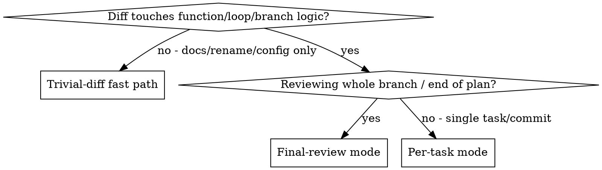

# Formal Code Review

## Overview

Formal analysis as a review pass: orchestrate `ultimatepowers:formalizing-code` then `ultimatepowers:verifying-specs` over a git diff in a review context, map the proof-derived findings into review severities, persist the evidence under `docs/ultimatepowers/verification/`, and return a reviewer-shaped report. This skill runs **automatically** whenever this plugin reviews code — there is no opt-in flag and no user gesture; the dispatched formal reviewer invokes this skill and follows it end to end.

**Core principle:** Scope shrinks with the diff; rigor does not. A smaller mode means fewer claims, never weaker labels.

Like its sub-skills, this skill never edits the code under review — the output is a report plus a durable evidence package.

**Announce at start:** "I'm using the formal-code-review skill to run formal analysis on this diff."

**REQUIRED SUB-SKILL:** Use ultimatepowers:formalizing-code
**REQUIRED SUB-SKILL:** Use ultimatepowers:verifying-specs
**REQUIRED BACKGROUND:** ultimatepowers:formal-reasoning-foundations

## Scoping Modes

Mode selection is automatic — made by this skill from the diff and the review context, never a user knob:



Tie-breaker: treat the review as whole-branch when the context is end-of-plan, finishing-a-development-branch, or pre-merge requesting-code-review, or when the git range spans multiple task commits; a review of a single task/commit is per-task.

- **Trivial-diff fast path** — doc-only / rename-only / config-only / comment-only diffs: record "no formal content changed" in FINDINGS.md and approve. No claims are constructed. Deciding triviality is THIS skill's job — examine the diff hunks, not the file list alone. A mixed diff (some hunks trivial, some logic) never takes the fast path: the logic hunks get per-task/final-review treatment and the trivial hunks are noted as non-formal in FINDINGS.md.
- **Per-task mode** — claims only for the functions/loops/branches the diff touches; reuse and extend the feature's existing semantics fragment (read the feature's `verification/` dir first); proofs at claim level — lemmas named, VC tables may be condensed; no `.k` file artifacts.
- **Final-review mode** — whole-change scope; adds cross-function composition (Transitivity across function contracts) and deeper circularity discharge; produces PROOF.md; may emit full runnable `<mod>.k` / `<mod>-spec.k` artifacts (the machine-check escape hatch). When the target language exceeds the bundled mini-imperative fragment family, runnable-artifact emission is itself an `[ESCALATION BOUNDARY]` obligation — state it; never invent K features to force a fit.

## The Workflow

Create a TodoWrite entry for each numbered step (use TodoWrite where available; otherwise track steps explicitly).

1. **Compute the diff.** `git diff --stat BASE..HEAD`, then `git diff BASE..HEAD`.
2. **Classify the mode** (graph above). Trivial-diff fast path → write the "no formal content changed" FINDINGS.md entry, then return the full report skeleton, not a bare approval: Strengths notes the trivial nature of the diff, Issues is empty, Assessment is "Ready to merge? Yes" with the standard status line and the artifact path. Done.
3. **Gather intent.** Priority order, same as formalizing-code: plan/spec docs under `docs/ultimatepowers/` → commit messages → code comments/docstrings/tests. Missing or contradicted intent is a finding, never an assumption.
4. **Formalize changed units** via `ultimatepowers:formalizing-code`, diff-scoped — in Final-review mode the diff is the whole branch; its expansion rule pulls callee contracts in contract-only.
5. **Construct proofs** via `ultimatepowers:verifying-specs`. Deep mode is opt-in by the caller, and this skill is that caller: in Per-task mode, invoke verifying-specs WITHOUT deep mode — condensed VC tables are this reviewer's own presentation choice, not a verifying-specs setting; in Final-review mode, explicitly request deep mode (runnable `<mod>.k` / `<mod>-spec.k` artifacts + PROOF.md).
6. **Map findings into review severities** (table below).
7. **Persist artifacts** (layout below).
8. **Return the review report** (format below).

## Severity Mapping

Proof-derived classification → reviewer schema. The merge verdict follows `ultimatepowers:requesting-code-review`'s rules: Critical and Important issues gate; Minor issues are noted for later.

| Proof-derived finding | Severity |
|---|---|
| Proven intent violation with concrete in-domain counterexample (`input → observed vs expected`) | Critical |
| Reachable stuck configuration = crash on valid input | Critical |
| Non-termination on in-domain input | Critical |
| Security-relevant missing guard (unchecked input reaching a sensitive sink) | Critical |
| Missing precondition the code silently assumes (misbehaves only out of intended domain) | Important |
| Unenforced documented precondition (e.g. "sorted list" never checked) | Important |
| Spec-difficulty signal (no clean precondition/invariant/closed form found) | Important |
| Undischarged VC pointing at a plausible code bug | Important |
| Test gap at a proof-exposed domain boundary | Important |
| Resource boundary (e.g. recursion depth, measured) | Important if the bound is provably reachable on in-domain input, else Minor |
| Intent-relevant implementation choice needing author confirmation (stability, duplicate policy, in-place mutation) | Minor + question for the author |
| Cross-language portability hazard not affecting the current language (e.g. `(lo+hi)//2` overflow) | Minor |
| Termination/performance recommendation (partial → total upgrade) | Minor |
| Test-redundancy note | Minor, recommendation-only, machine-check-gated |
| Positive finding / deliberate non-finding | Strengths section |
| Capability gap `[ESCALATION BOUNDARY]` | "Verification limits" section — NOT an Issue, never blocks merge |

Scope note: the Critical "proven intent violation" row means a violation of the changed unit's behavioral contract; promises made only in auxiliary prose (diagnostics wording, doc phrasing) classify as underspecified intent — Important at most.

Two verifying-specs classifications map onto existing rows: `needed code guard` follows the Missing-precondition row — Important, rising to Critical when the unguarded path is a reachable crash/violation on valid input (per the Critical rows above); `underspecified intent` follows the Spec-difficulty row — Important.

**Fallback:** a sub-skill classification with no row here is treated as Important, and a row is added citing this rule — never weaker labels.

**Capability gaps are kit limits, not code bugs.** They are reported under Verification limits with their open obligations specified, and never inflate severity.

## Artifact Persistence

Artifacts are durable on purpose — `verification/` is a sibling of `specs/` and `plans/`:

```
docs/ultimatepowers/verification/YYYY-MM-DD-<topic>/
  SPEC.md       — contracts in K notation + plain language
  FINDINGS.md   — evidence, classification, recommended change, status labels
  PROOF.md      — constructed-proof sketch (final-review/deep mode)
  <mod>.k, <mod>-spec.k — runnable K artifacts (deep mode only)
```

`<topic>` is the feature slug from the active plan filename (`docs/ultimatepowers/plans/YYYY-MM-DD-<topic>.md`); for ad-hoc reviews, a deterministic slug: the first 3-5 words of the change description (or, absent one, the commit subject), lowercased and hyphenated (e.g. "Fix overflow in parser" → `fix-overflow-in-parser`). The date is the date the dir was first created. **Per-task SDD reviews APPEND to the feature's existing dir** — FINDINGS.md gains a `## Task N — <date>` section, SPEC.md accretes claims — rather than creating one dir per task. Commit the artifacts with the review.

## Report Format

Identical to the reviewer output in `requesting-code-review/code-reviewer.md`, plus three formal additions: a per-issue `Formal evidence:` line, a `### Verification limits` section, and the artifact path + status label under the assessment.

```
### Strengths
[What's well done? Be specific. Positive findings and deliberate non-findings report here.]

### Issues

#### Critical (Must Fix)
[Proven intent violations, reachable crashes, non-termination, security-relevant missing guards]

#### Important (Should Fix)
[Missing/unenforced preconditions, spec-difficulty signals, suspicious VCs, test gaps]

#### Minor (Nice to Have)
[Author-confirmation questions, portability hazards, termination upgrades, test-redundancy notes]

For each issue:
- File:line reference
- What's wrong, as `input → observed vs expected` where applicable
- Formal evidence: [claim / branch / VC / side condition behind it]
- Why it matters
- How to fix (if not obvious)

### Recommendations
[Improvements for code quality, spec quality, or process]

### Verification limits
[Each [ESCALATION BOUNDARY] with its open obligations specified, plus the trusted base
(fragment adequacy; reachability metatheory; Z3/`[simplification]` (a K rule attribute) oracle).
Not Issues — never block merge.]

### Assessment

**Ready to merge?** [Yes | No | With fixes]

**Reasoning:** [1-2 sentence technical assessment]

Artifacts: docs/ultimatepowers/verification/YYYY-MM-DD-<topic>/
Status: [constructed | constructed (escalation-bounded)] — machine-checked only if an actual #Top exists
```

## Honesty Rules

Restated from the foundations; frozen. Apply before emitting the report:

- Never label constructed reasoning `machine-checked` — an actual `kprove` → `#Top` is the only upgrade.
- Never fake an `[ESCALATION BOUNDARY]`: an obligation the bundled tier cannot discharge is stated openly, never admitted `[trusted]`.
- Capability gaps are never reported as code bugs; they go under Verification limits.
- Findings cite a concrete `input → observed vs expected`.
- Positive findings and deliberate non-findings are reported, not dropped.
- Test deletion is only ever recommended — gated on `#Top` — never performed.

## Red Flags

| Excuse | Reality |
|--------|---------|
| "Diff is tiny, skip formal analysis" | The fast path still writes its FINDINGS.md entry; deciding triviality requires reading the diff. |
| "Construct a quick 'proof' and call it verified" | Status label is `constructed`; say so in the verdict. |
| "The escalation boundary blocks merge" | Verification limits never block; only Critical/Important code findings gate. |
| "Skip artifact persistence to save time" | Artifacts are the deliverable; per-task mode may be brief but never empty. |
| "Reformalize everything each task" | Per-task mode reuses the feature's fragment and claims. |

*Derived from grosu/formal-verification-kit (MIT, Copyright (c) 2026 Grigore Rosu). See LICENSE and README credits.*
